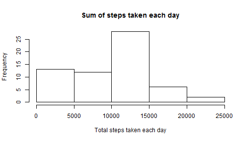
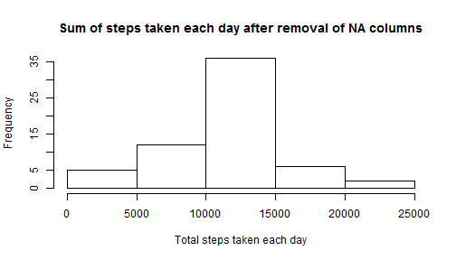
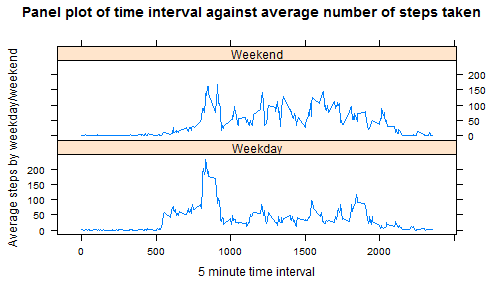

# Reproducible Research - Peer Assessment 1
## Processing and Analysing Data collected from Activity Monitoring Devices  
### Date 14th Nov, 2014
========================================================

## Global settings

```r
opts_chunk$set(echo = TRUE, fig.height = 4)
```


## Load and pre-process the data from activity.csv file  
Note:Ensure setwd() if generating from a different location

```r
unzip("activity.zip")
activity.data <- read.csv("activity.csv", header = TRUE)
```


## What is the mean total number of steps taken per day
For this part of the assignment, you can ignore the missing values in the dataset.  
- Make a histogram of the total number of steps taken each day  


```r
# total_steps<-by(activity.data$steps, activity.data$date, sum, na.rm=TRUE)
total_steps <- aggregate(activity.data$steps, by = list(activity.data$date), 
    sum, na.rm = T)$x

hist(total_steps, main = "Sum of steps taken each day", xlab = "Total steps taken each day")
```

 

- Calculate and Report the mean and median total number of steps taken each day  
### Mean total number of steps per day

```r
mean_steps <- mean(total_steps, na.rm = T)
mean_steps
```

```
## [1] 9354
```

### Median total number of steps per day

```r
median_steps <- median(total_steps, na.rm = T)
median_steps
```

```
## [1] 10395
```


## What is the average daily activity pattern
- Make a time series plot (i.e. type = "l") of the 5-minute interval (x-axis) and the average number of steps taken, averaged across all days (y-axis)  


```r
require(lattice)
```

```
## Loading required package: lattice
```

```r
require(stats)
# intervals.average<-tapply(activity.data$steps, activity.data$interval,
# mean, na.rm=TRUE)
intervals.average <- aggregate(steps ~ interval, activity.data, mean)
xyplot(steps ~ interval, data = intervals.average, ylab = "Average steps averaged across all days", 
    xlab = "5 minute time interval", main = "Time series plot", type = "l")
```

 

```r

# plot(intervals.average$steps, intervals.average$interval, type='l',
# xlab='Average steps averaged across all days', ylab='5 minute time
# interval', main='Time series plot')
```

- Which 5 minute interval, on average across all the days in the dataset contains the maximum number of steps  


```r
max.avg <- intervals.average[intervals.average$steps == max(intervals.average$steps), 
    c("interval")]
max.avg
```

```
## [1] 835
```


## Imputing missing values  
- Calculate and report number of missing values in the dataset

```r
num <- sum(!complete.cases(activity.data$steps))
num
```

```
## [1] 2304
```

- Devise a strategy for filling in all of the missing values in the dataset. The   strategy does not need to be sophisticated. For example, you could use the mean    
  /median for that day, or the mean for that 5-minute interval, etc.  

- Create a new dataset that is equal to the original dataset but with the missing data filled in.  


```r
# Replace nas with mean for that 5 minute interval, calculated in the
# previous part
data.naomited <- activity.data
cnt <- 0
for (i in 1:nrow(data.naomited)) {
    
    if (is.na(data.naomited$steps[i])) {
        data.naomited$steps[i] <- intervals.average[data.naomited$interval[i] == 
            intervals.average$interval, c("steps")]
        cnt <- cnt + 1
    }
    
}
# Total replaced
cnt
```

```
## [1] 2304
```

```r
# Should now be zero
sum(is.na(data.naomited))
```

```
## [1] 0
```


## Make a histogram of the total number of steps taken each day and Calculate and   report the mean and median total number of steps taken per day. Do these values   differ from the estimates from the first part of the assignment? What is the   impact of imputing missing data on the estimates of the total daily number of   steps?  

```r
total_steps_new <- aggregate(data.naomited$steps, by = list(activity.data$date), 
    sum, na.rm = T)$x
hist(total_steps_new, main = "Sum of steps taken each day after removal of NA columns", 
    xlab = "Total steps taken each day")
```

 

```r
mean_steps_new <- mean(total_steps_new)
median_steps_new <- median(total_steps_new)
```

### Mean with new clean data set without NAs

```r
mean_steps_new
```

```
## [1] 10766
```

### Median with new clean data set without NAs

```r
median_steps_new
```

```
## [1] 10766
```


### It can be seen that both mean and median have now increased with the change in NA values to mean value for that interval. In the first calculation, Na values are treated as 0 by default which is now replaced with the average for that interval in this case. Thus we see the difference in the calculation.

## Are there differences in activity patterns between weekdays and weekends?  
For this part the weekdays() function may be of some help here. Use the dataset   with the filled-in missing values for this part.  
- Create a new factor variable in the dataset with two levels - "weekday" and   "weekend" indicating whether a given date is a weekday or weekend day.  


```r
data.naomited$dayofweek <- format(as.Date(data.naomited$date), "%A")
# ifelse(weekdays(as.Date(data.naomited$date)), 'Weekday', 'Weekend');
data.naomited$dayofweek <- ifelse(data.naomited$dayofweek %in% c("Monday", "Tuesday", 
    "Wednesday", "Thursday", "Friday"), "Weekday", "Weekend")
data.naomited$dayofweek <- as.factor(data.naomited$dayofweek)
```


- Make a panel plot containing a time series plot (i.e. type = "l") of the 5 
  -minute interval (x-axis) and the average number of steps taken, averaged   across all weekday days or weekend days (y-axis). See the README file in the   GitHub repository to see an example of what this plot should look like using     simulated data.

```r
avg.data <- aggregate(data.naomited$steps, list(data.naomited$interval, data.naomited$dayofweek), 
    mean)
colnames(avg.data) <- c("interval", "dayofweek", "mean")
library(lattice)
xyplot(avg.data$mean ~ avg.data$interval | avg.data$dayofweek, type = "l", layout = c(1, 
    2), xlab = "5 minute time interval", ylab = "Average steps by weekday/weekend", 
    main = "Panel plot of time interval against average number of steps taken", 
    color = "blue")
```

 

